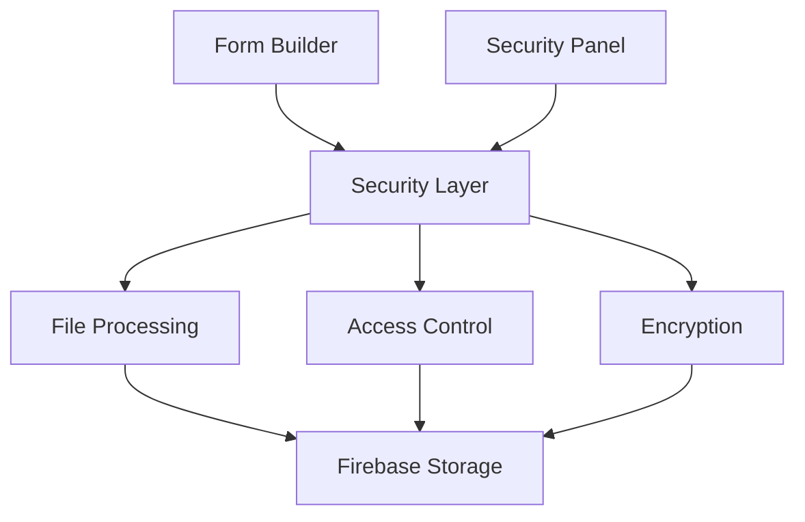

# Form Feedback Architecture

## System Overview

Our form feedback system is built with security and user privacy at its core. Here's how the components work together:

### 1. Form Builder Component

```typescript
// components/forms/builder/FormBuilder.tsx

interface FormConfiguration {
  // Basic form settings
  formId: string;
  title: string;
  fields: FormField[];

  // Security and privacy settings
  security: {
    encryption: {
      level: 'standard' | 'high';
      endToEndEncryption: boolean;
    };
    access: {
      authentication: 'required' | 'optional' | 'none';
      allowedDomains?: string[];
      maxSubmissions?: number;
    };
    privacy: {
      dataRetention: number; // days
      gdprCompliant: boolean;
      dataPurpose: string;
    };
  };
}
```

The Form Builder is the central component that integrates:
- Form configuration and fields
- Security settings
- Privacy controls
- Access management

### 2. Security Integration Layer

The security system integrates at multiple levels:

1. **Form Creation**:
   - Encryption settings configuration
   - Access control setup
   - Privacy policy definition

2. **Data Processing**:
   - File upload validation
   - Content encryption
   - Access logging

3. **Storage**:
   - Secure file storage
   - Key management
   - Data retention

## Component Interaction Flow

1. **Form Configuration**:
```typescript
const [formConfig, setFormConfig] = useState<FormConfiguration>({
  // ... basic form settings
  security: defaultSecuritySettings
});
```

2. **Security Panel**:
```typescript
const SecurityPanel = () => {
  // Encryption settings UI
  // Access control configuration
  // Privacy settings management
}
```

3. **Integration with File System**:
- Forms can include file upload fields
- Files are processed through our security pipeline
- Access controls are enforced at storage level

## Current Implementation Status

We have implemented:
1. ✅ Core security infrastructure
2. ✅ File processing pipeline
3. ✅ Access control system
4. ✅ Encryption system

## Next Steps

1. **Frontend Integration**:
   - Implement the Form Builder UI
   - Create the Security Settings panel
   - Add form field components
   - Integrate with file upload system

2. **Backend Services**:
   - Set up Firebase configuration
   - Implement authentication flow
   - Configure storage rules
   - Set up key management system

3. **Testing & Validation**:
   - Security penetration testing
   - Performance testing
   - User acceptance testing
   - Compliance verification

4. **Deployment**:
   - Set up CI/CD pipeline
   - Configure production environment
   - Implement monitoring
   - Create backup systems

## System Architecture



## Integration Points

1. **Form Builder → Security Layer**:
   - Security configuration
   - Field validation rules
   - Access control settings

2. **Security Layer → Storage**:
   - File encryption
   - Access logging
   - Key management

3. **User Interface → Backend**:
   - Authentication
   - Form submission
   - File uploads

## Development Guidelines

1. **Security First**:
   - Always validate input
   - Encrypt sensitive data
   - Log security events
   - Regular security audits

2. **Performance**:
   - Optimize file processing
   - Efficient encryption
   - Smart caching
   - Lazy loading

3. **User Experience**:
   - Clear security settings
   - Intuitive interface
   - Responsive design
   - Error handling

4. **Maintenance**:
   - Regular key rotation
   - Log monitoring
   - System updates
   - Security patches
